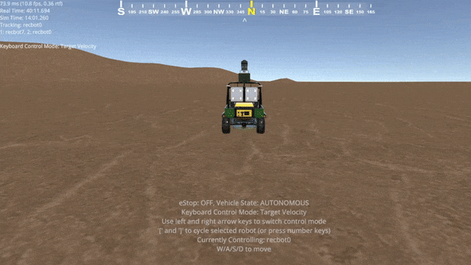
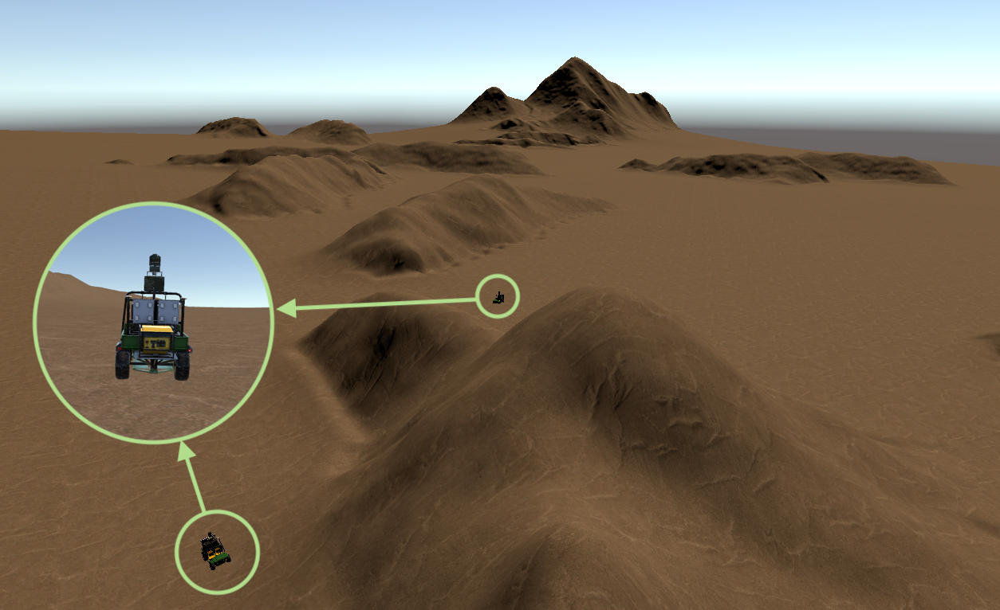

## Repo for Stealthy Terrain-Aware Multi-Agent Active Search

Unofficial name: STAR this if you have GUTS

Example of a Target being Detected | Overhead View of the Scene on the left | Still showing scale of fullsize vehicles and massive landscape
:-------------------------:|:----------------------------:|:----------------------:
 |  | 

A known terrain map informs stealthy behaviour such as moving through regions of greater concealment (for eg. between/close around mountains) as well as efficient search behaviours such as searching in better hiding places.

Published in Conference on Robot Learning (CoRL) 2023

```

@inproceedings{
bakshi2023stealthy,
title={Stealthy Terrain-Aware Multi-Agent Active Search},
author={Nikhil Angad Bakshi and Jeff Schneider},
booktitle={7th Annual Conference on Robot Learning},
year={2023},
url={https://openreview.net/forum?id=eE3fsO5Mi2}
}

```

### Run the STAR algorithm and recreate ablation experiments

In order to run the repo the dependencies are ROS melodic and python2.7 with numpy, matplotlib and PIL.

To recreate the experiments or just run the algorithm you should use docker:
- Install docker following this link: https://docs.docker.com/engine/install/
- Recommended OS is Ubuntu 18.04
- Then run the following command to download the necessary image and start the container
```
bash start_docker.sh
```
- Inside the docker container:
```
cd /home/user/src
bash init.sh
```
- Ignore any pip install errors that occur if they do, then:
```
cd zone_recon
source devel/setup.bash
USER=user ROS_LOG_DIR=/home/user/src/zone_recon/logs bash test_mysim.sh 100 star 5 4
```
- The syntax for the above command is `test_mysim.sh <runtime budget in seconds> <algorithm: star, rsi, guts, coverage, random> <number of targets> <number of agents: 1 2 4 or 8>`
More detailed instructions to follow to recreate experiments.
- Feel free to try any of combinations. The runs can be seen in the logging folder such that every robot has logs (replicating the real life system).
- The results for the paper were generated using the `experiments{_multi,_simplesim}.sh` scripts and they take several days for realistic simulations and several hours for the simplified simulator.
- The main code for STAR, GUTS, RSI, COVERAGE and RANDOM policies tested for adversarial multi agent active search in this paper can be found written in src/zone_recon/src/waypoint_planner/src/waypoint_planner/active_search.py.


### License

N. A. Bakshi and J. Schneider are with the Robotics Institute, School of Computer Science, Carnegie Mellon University, Pittsburgh, PA 15213

(c) Nikhil Angad Bakshi 2023 (nabakshi@cs.cmu.edu)

Please cite the following paper to use the code:

@inproceedings{
bakshi2023stealthy,
title={Stealthy Terrain-Aware Multi-Agent Active Search},
author={Nikhil Angad Bakshi and Jeff Schneider},
booktitle={7th Annual Conference on Robot Learning},
year={2023},
url={https://openreview.net/forum?id=eE3fsO5Mi2}
}
