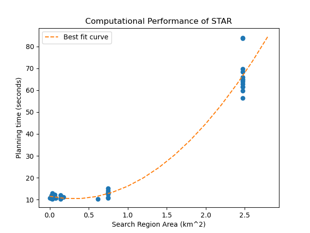

## Anonymous Repo for Stealthy Terrain-Aware Multi-Agent Active Search

This repo has been anonymized.

### Planning Time vs Search Region Area

This section has been added for the benefit of the reviewers.




The planning time in search regions under a square km is around 10-15 secs.  At 2.5 km^2, it rises to over a minute. We would like to point out that in practice the robot can just start planning its next decision slightly before it expects to arrive at its next goal location so this planning time doesn't meaningfully impact search performance. This was an engineering detail which we didn't include because throughout the paper we evaluate the algorithms on their sample complexity rather than wall clock time. The compute on the robot is a Nuvo-8108GC with Intel Xeon E-2278GEL (Coffee Lake R) 2.0 GHz Processor - 35W.


### Run the STAR algorithm and recreate ablation experiments

In order to download the repo, download the file `star.zip` ONLY. It contains this repo (minus the `star.zip` file itself of course)

In order to run the repo the dependencies are ROS melodic and python2.7 with numpy, matplotlib and PIL.

To recreate the experiments or just run the algorithm you should use docker:
- Install docker following this link: https://docs.docker.com/engine/install/
- It is possible the above hyperlink has not rendered due to the anonymization process which disallows links. You can just google how to install docker and follow the official documentation.
- Recommended OS is Ubuntu 18.04
- Then run the following command to download the necessary image and start the container
```
bash start_docker.sh
```
- Inside the docker container:
```
cd /home/user/src
bash init.sh
```
- Ignore any pip install errors that occur if they do, then:
```
cd zone_recon
source devel/setup.bash
USER=user ROS_LOG_DIR=/home/user/src/zone_recon/logs bash test_mysim.sh 100 star 5 4
```
- The syntax for the above command is `test_mysim.sh <runtime budget in seconds> <algorithm: star, rsi, guts, coverage, random> <number of targets> <number of agents: 1 2 4 or 8>`
More detailed instructions to follow to recreate experiments.
- Feel free to try any of combinations. The runs can be seen in the logging folder such that every robot has logs (replicating the real life system).
- The results for the paper were generated using the `experiments{_multi,_simplesim}.sh` scripts and they take several days for realistic simulations and several hours for the simplified simulator.
- The main code for STAR, GUTS, RSI, COVERAGE and RANDOM policies tested for adversarial multi agent active search in this paper can be found written in src/zone_recon/src/waypoint_planner/src/waypoint_planner/active_search.py.
